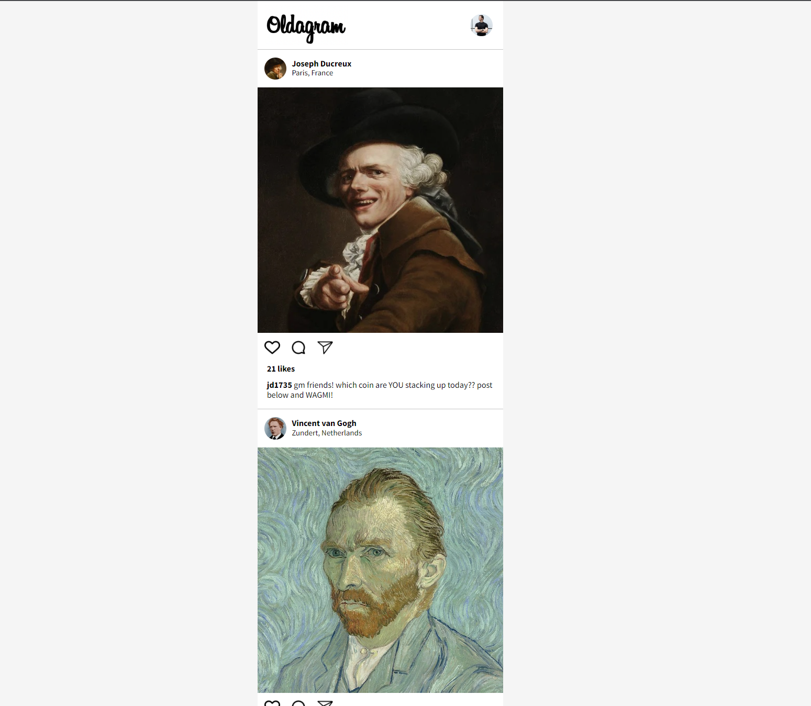
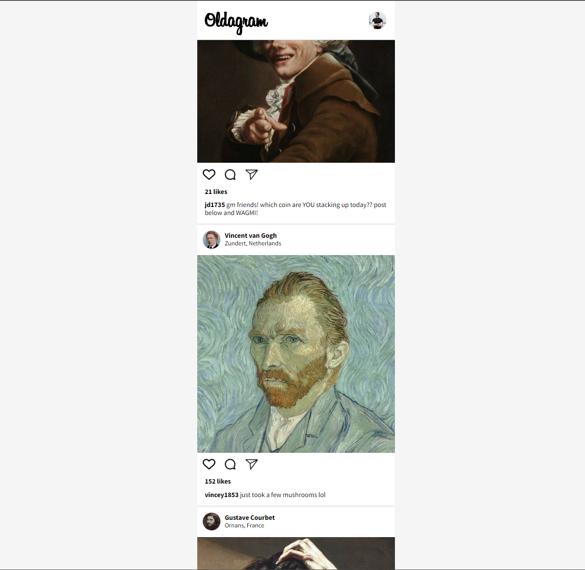

# Scrimba - The Frontend Developer Carrer Path - Module 4 - Oldagram project

Hello and welcome! Thank you for stopping by.🤠

This is a solution to the Oldagram project from _Module 4 - Essential CSS concepts - CSS Fundamentals: Challenges chapter_ of the [The Frontend Career Path](https://scrimba.com/learn/frontend).

## Table of contents

- [Overview](#overview)
  - [The project](#the-challenge)
  - [Screenshot](#screenshot)
  - [Links](#links)
- [My process](#my-process)
  - [Built with](#built-with)
  - [What I learned](#what-i-learned)
  - [Continued development](#continued-development)
- [Author](#author)
- [Acknowledgments](#acknowledgments)
- [About Scrimba](#about-scrimba)

## Overview

### The project

Users should be able to:

- See Oldagram posts of the three famous people

### Screenshot

Oldagram in idle

Oldagram durring scrolling

### Links

- Solution URL: [Github Repository](https://github.com/PetrValenta92/oldagram)
- Live Site URL: [Github Pages](https://petrvalenta92.github.io/oldagram/)

## My process

### Built with

- Semantic HTML5 markup
- CSS custom properties
- CSS pseudoclasses
- Flexbox
- BEM

### What I learned

On this project, I mainly practiced my new knowledge of semantic HTML and CSS skills, I have learned and practiced how to work with BEM and practiced my work with Figma template.

### Continued development

In the future, I would like to add some JavaScript. I would like to add events for click on heart icon and double-click on post picture. Both events will change the heart icon's design and add "+1" to post's likes. Another double/click will undo the action (and add "-1" to likes). Also I would like to make the page more dinamic. Post will be rendered randomly from the "post database". Other posts of "Old VIP" profiles will be added.

## Author

- Website - _to be added..._
- GitHub - [@PetrValenta92](https://github.com/PetrValenta92)
- LinkedIn - [@valentapetr](https://www.linkedin.com/in/valentapetr/)
- Instagram - [@petr.codes](https://www.instagram.com/petr.codes/)

## Acknowledgments

I would love to thank whole [Scrimba](https://scrimba.com) team for such amazing project they have created. I want to thank the Scrimba community and specialy the [Junior Guru Community](https://junior.guru/) community! 🐣

## About Scrimba

At Scrimba our goal is to create the best possible coding school at the cost of a gym membership! 💜
If we succeed with this, it will give anyone who wants to become a software developer a realistic shot at succeeding, regardless of where they live and the size of their wallets 🎉
The Frontend Developer Career Path aims to teach you everything you need to become a Junior Developer, or you could take a deep-dive with one of our advanced courses 🚀

- [Our courses](https://scrimba.com/allcourses)
- [The Frontend Career Path](https://scrimba.com/learn/frontend)
- [Become a Scrimba Pro member](https://scrimba.com/pricing)

Happy Coding!
